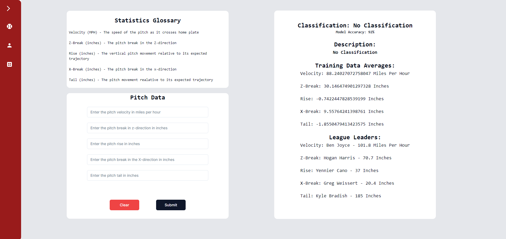
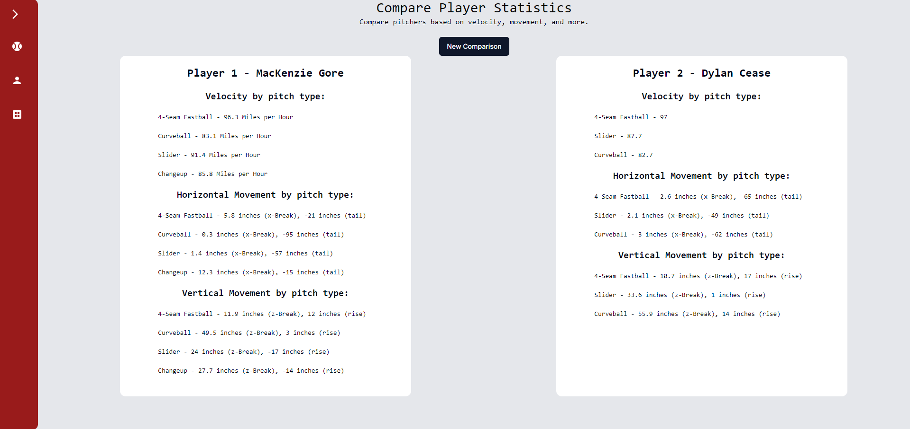
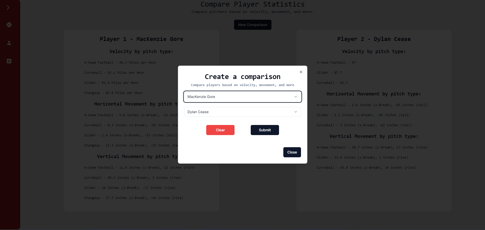
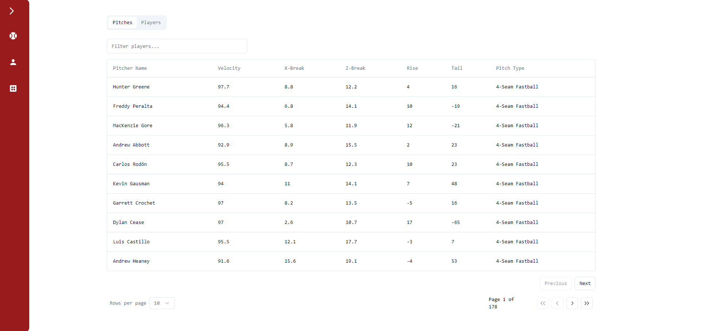
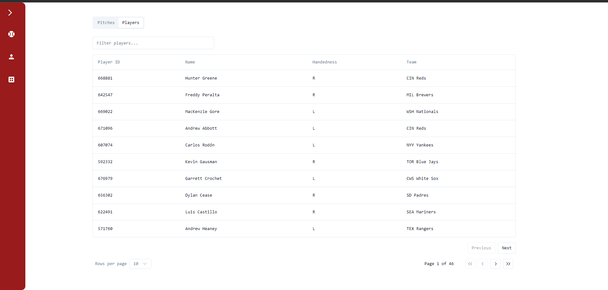

## MLB Stat Classifier - A machine learning application for better understanding the MLB, developed by Vivek Jagadeesh

Note - This readme serves a "user manual" for this application. A detailed explanation of my experience developing the application (along with other projects), and the construction of the technology stack is available at <a href="https://vivekjagadeesh.com/MLBClassifier">vivekjagadeesh.com/MLBClassifier</a>. 

<h2>Overview and Motivation</h2>

    As a lifelong fan of the Boston Red Sox, I've frequently found myself asking "what pitch was that?" while watching the games. As I began to learn more about machine learning, I found that classifying MLB pitches would be a fun introduction to the field.
     
    <h3>Features</h3>
    This application contains the following features
    <ul>
        <li> A machine learning model for classifying MLB pitches (more on this later) </li>
        <li> A tool for comparing MLB pitchers on the basis of velocity, horizontal and vertical movement </li>
        <li> A tool for viewing historical pitch and player data from baseball savant </li>
    </ul>   

<h2>Getting Started - Classifying a pitch </h2>

The first feature of MLB Classifier is the ability to classify any pitch using the following features: 

 <ul>
        <li> The pitch velocity</li>
        <li> The movement in the Z direction </li>
        <li> The rise (vertical movement relative to its expected path)</li>
        <li> The movement in the x direction </li>
        <li> The tail (horizontal movement realtive to its expected path) </li>
    </ul>  

Note - A detailed description of how the dataset and features were selected is available on my portfolio website at <a href="https://vivekjagadeesh.com"> vivekjagadeesh.com</a>
 
 

To classify a pitch, simply enter the features into the form in the bottom left hand corner, and use the submit button to run the classifier. The clear button is used to remove any temporary entries in the form. 

<h2>Using the player comparison tool</h2>

To compare two players, start by clicking the "New Comparison" button in the center. This will open a modal where you can select the players that you would like to compare via the two drop-down menus (these contain active players as of August 2024)
. 
Once you have selected two players to compare, continue by clicking submit, and the statistics for each player will appear in the two panes on the screen. 
<h2>Viewing historical MLB data</h2>

 Finally, the last feature of MLB Classifier is the ability to view historical data from Baseball Savant. To individual pitches (and their related statistics), use the slider at the top of the page to select pitches. To view pitchers, selected pitchers and the below table will appear. Finally, pagination controls are available at the bottom of the table

<h2>Appendix - Building and Running the project </h2>

 To run this project, clone the repository and run <code> npm run start</code> in the  <strong> root directory<strong>. This will start both the frontend (next.js) and backend (flask). Additionally, you will need to have a local postgresql server running and configure the connection string. To run just the frontend, run <code> npm run dev </code> in the frontend directory. To run just the backend, run <code> flask run </code> in the backend directory. 
